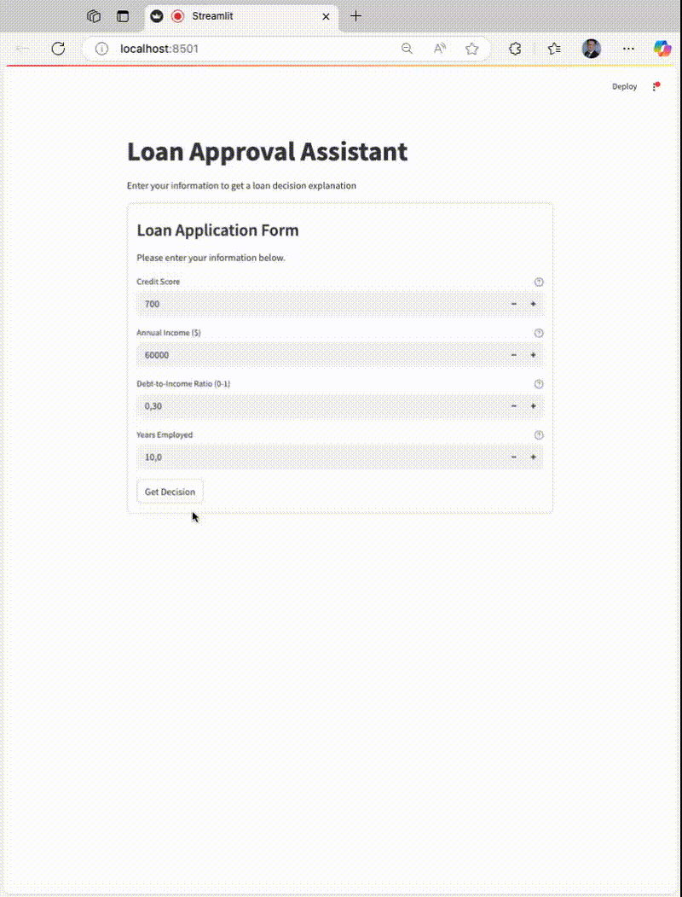

# AI-Powered Loan Approval System: From Explainability to Intelligence

This repository demonstrates a comprehensive approach to building an intelligent loan approval system, progressing from model interpretability to an interactive RAG-based assistant.

## Part 1: Model Interpretability

The first part focuses on understanding and explaining AI model predictions in the loan approval context using state-of-the-art interpretability techniques.

### Features
- LIME (Local Interpretable Model-agnostic Explanations) for individual predictions
- SHAP (SHapley Additive exPlanations) for feature importance analysis
- Comparison with inherently interpretable models like decision trees
- Comprehensive visualizations


### Setup & Usage
```bash
# Create and activate virtual environment
python -m venv venv
source venv/bin/activate  # On Windows: venv\Scripts\activate

# Install dependencies
pip install -r requirements.txt

# Start Jupyter Notebook
jupyter notebook
```

Navigate to `model_interpretability/model_explanations.ipynb` to explore the demonstrations.

## Part 2: Intelligent Loan Approval Assistant

Building upon our understanding of model interpretability, we've developed an interactive loan approval assistant using Retrieval Augmented Generation (RAG) technology.

### Features
- Interactive Streamlit web interface
- RAG-based decision explanation using domain-specific knowledge
- Real-time loan approval decisions
- Detailed criteria analysis and explanations
- Integration with Microsoft's Phi-2 language model

### Demo


[▶️ Download the original demo video (.webm)](loan_approval_rag/streamlit-app.webm)

### Setup & Usage
```bash
# Ensure you're in the virtual environment
cd loan_approval_rag
pip install -r requirements.txt

# Run the Streamlit app
streamlit run src/app.py
```

## Project Evolution

This repository showcases the evolution of AI in loan approval systems:

1. **Understanding the Black Box**: We start with model interpretability, making AI decisions transparent and trustworthy through LIME and SHAP analysis.

2. **Enhancing with Intelligence**: We then progress to a RAG-based system that not only makes decisions but also provides context-aware explanations by leveraging domain knowledge and large language models.

## Technical Stack

### Model Interpretability
- LIME & SHAP for model explanations
- Scikit-learn for traditional ML models
- Matplotlib & Seaborn for visualizations

### RAG-based Assistant
- LangChain for RAG pipeline
- Microsoft Phi-2 for language modeling
- Streamlit for web interface
- FAISS for vector storage
- Sentence Transformers for embeddings

## Note

This repository is part of a book project demonstrating the practical evolution of AI systems, from explainable models to intelligent assistants. Each component is designed to showcase best practices in both technical implementation and user experience.